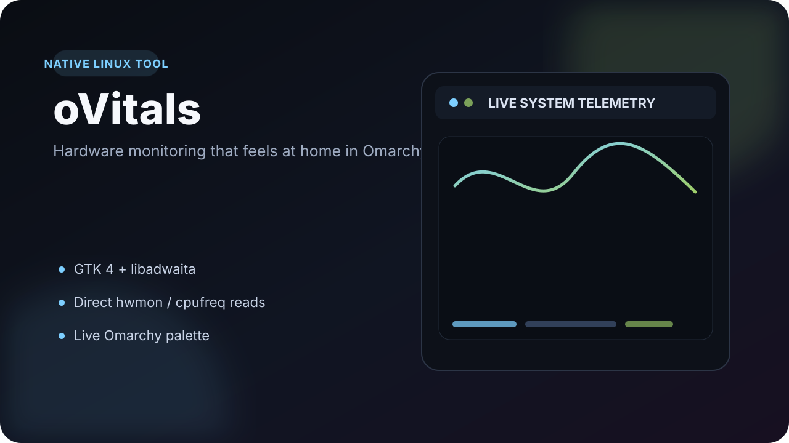

<p align="center">
  
</p>

# oVitals

**A compact native hardware monitor built for Omarchy and Hyprland.**

oVitals turns the sensor data Linux already exposes into a clean GTK 4/libadwaita dashboard with live CPU, RAM and VRAM usage, hardware readings, and session minimum/maximum values. It is intentionally local, lightweight, and native to the desktop instead of wrapping a browser UI or requiring a monitoring daemon.

## Why I built it

I wanted the useful density of tools like HWiNFO, but in an interface that feels natural on my Linux desktop. The result is a focused monitor that reads the kernel's existing interfaces directly and follows the active Omarchy color palette automatically.

## Highlights

- Native **GTK 4 + libadwaita** interface on Wayland
- CPU core utilization bars plus **RAM and VRAM history**
- Temperatures, CPU/GPU clocks, voltages and fan speeds when exposed by drivers
- Session **Current / Minimum / Maximum** values for every sensor
- Direct reads from Linux **hwmon** and **cpufreq**
- Optional NVIDIA metrics through `nvidia-smi`
- Live theme reload from the active Omarchy `colors.toml`
- No background monitoring daemon required
- Resettable session extrema and a simple session timer

## How it works

```text
Linux kernel interfaces
  ├─ /sys/class/hwmon
  ├─ /sys/devices/.../cpufreq
  └─ nvidia-smi (optional)
           │
           ▼
     SensorManager
           │
           ├─ discovery + human labels
           ├─ sampling
           └─ session min/max
           │
           ▼
   GTK 4 / libadwaita UI
           │
           └─ Omarchy palette → live CSS
```

The app reports what the running system actually exposes. It does not invent sensor values or silently probe unknown motherboard hardware.

## Run it

On a normal Omarchy desktop the GTK, libadwaita, Python and PyGObject dependencies are typically already available.

```bash
git clone https://github.com/Khanos/ovitals.git
cd ovitals
./run
```

To add oVitals to the application launcher:

```bash
./install.sh
```

The installer places the command and desktop entry under `~/.local` and checks the native dependencies through Omarchy's package tooling.

## Sensor availability

oVitals depends on what Linux exposes through the active drivers.

If a category is empty, check `sensors` first. Motherboard voltage and fan readings may require the correct Super-I/O driver. NVIDIA-specific readings require a working `nvidia-smi`, but the rest of the application does not depend on NVIDIA tooling.

For the motherboard sensor investigation that informed the project, see [SENSOR_SUPPORT_RESEARCH.md](SENSOR_SUPPORT_RESEARCH.md).

## Project layout

```text
vitals/
  app.py       GTK widgets, charts, table and session UI
  sensors.py   discovery, sampling, labels and extrema
  theme.py     Omarchy palette loading and generated CSS
data/          desktop integration files
tests/         fake-sysfs tests
```

## Tests

```bash
make check
```

The test suite uses a temporary fake sysfs tree and does not modify system files.

---

Built as a small experiment in making Linux tooling feel less like a utility window and more like part of the desktop.
